# OpenTool-Cloud
这是一个基于微服务框架+Vue3的开源工具平台


#                                            Open Tool v1.0.0

​													**基于 Vue3/Ant Design 和 Spring Boot/Spring Cloud & Alibaba前后端分离的分布式微服务架构**

## 平台简介

OpenTool 是一个一站式的开放智能工具平台，旨在将实用高效的传统工具与AI工具结合起来，帮助用户提升工作效率，并鼓励开发者在该平台上进行应用场景的创新。

- 采用前后端分离架构，前端基于Vue3、Vite、Ant Design（[OpenTool-Ui][https://github.com/yangzhenyu322/OpenTool]）

- 后端采用Spring Boot、Spring Cloud & Alibaba

- Nacos注册中心、Feign远程调用、Spring Cloud Gateway网关、Spring Security安全框架 + JWT认证

  Mysql数据库、Redis缓存

## 系统模块

```
com.opentool
|--opentool-ui             // 前端框架 【80】
|--opentool-gateway        // 网关模块 【8080】
|--opentool-api            // 接口模块
|		└──opentool-api-system                      // 系统接口
|--opentool-common         // 通用模块
|		└──opentool-common-core                     // 核心模块
|--opentool-modules        // 业务模块
|		└──opentool-system                          // 系统服务模块     【8081】
|		└──opentool-dashboard                       // 仪表盘业务模块   【8082】
|		└──opentool-general-tool					// 实用工具业务模块  【8083】
|		└──opentool-ai-tool                         // AI工具业务模块   【8084】
|--pom.xml					// 公共依赖
```

## 内置功能

1. 数据分析：可视化网站运营数据，以echart图表将相关数据进行实时展示
2. 工作台：用户的任务管理中心，可以查看代办事项和网站最新动态；管理员可以查看服务运行状况和用户数据
3. 表单设计：包括基础表单和分布表单的实现，用于构建其他界面的组件
4. Echarts图表：实现了常用的Echart图表，用于构建其他界面的组件
5. 编辑器：包含MarkDown和富文本编辑器，提供给用户进行文档撰写
6. 图像处理：格式转换工具支持将图像格式转换为指定格式图像；图像抠图可以对人物、物品背景及逆行自动抠图
7. Json解析：帮助用户对Json字符串进行格式解析
8. ChatGPT：AI聊天机器人，支持gpt3.5、gpt4和Dall的最新模型
9. 文本转语音：将文本转换为音频，可以自定义语音合成设置
10. 语音转文本：将音频识别成文字文本，支持语音上传和音频录制上传

## 演示图


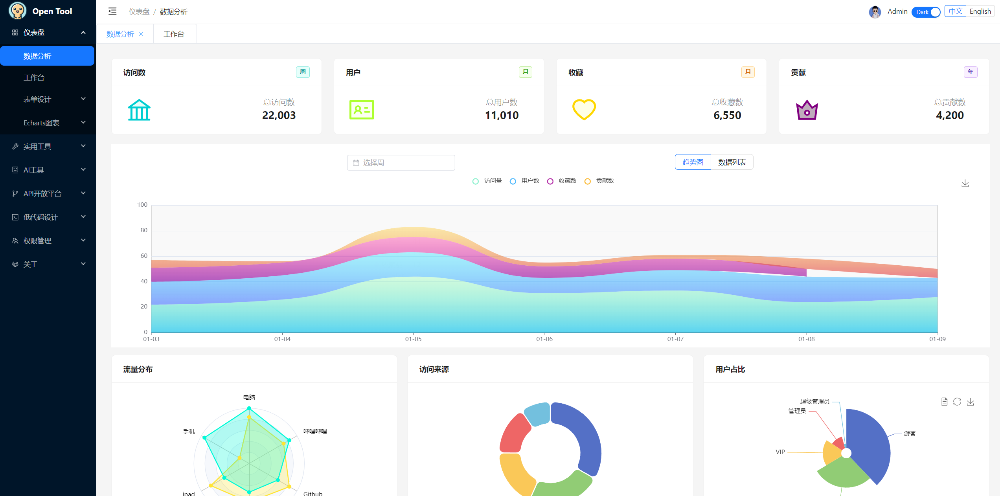

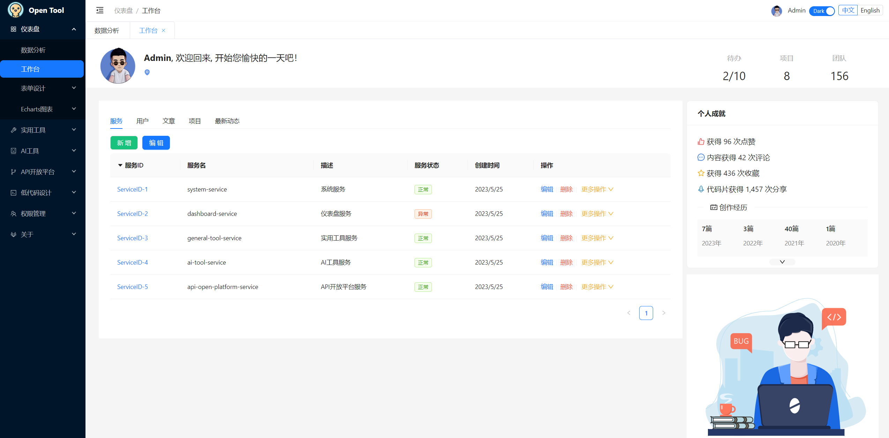

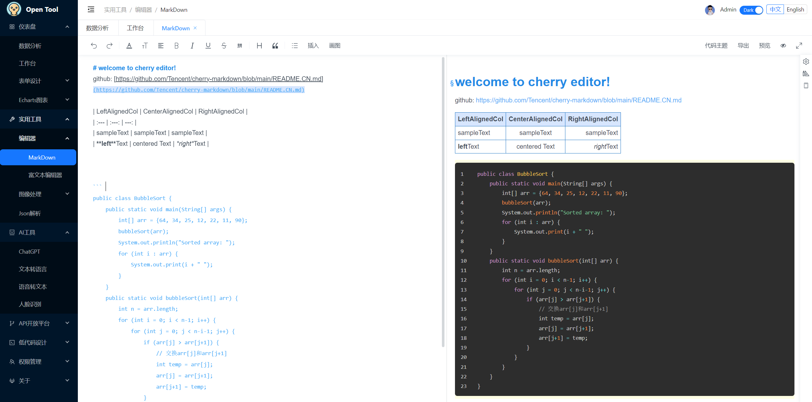

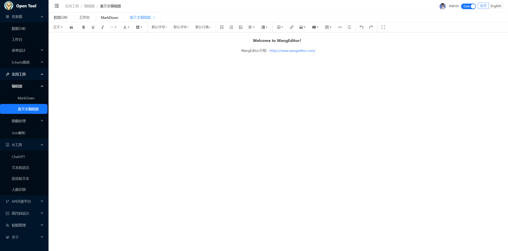

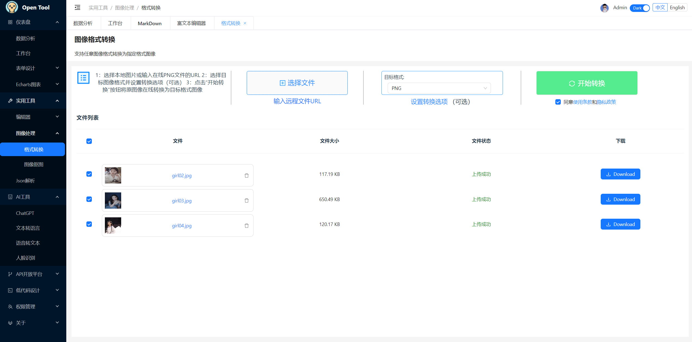

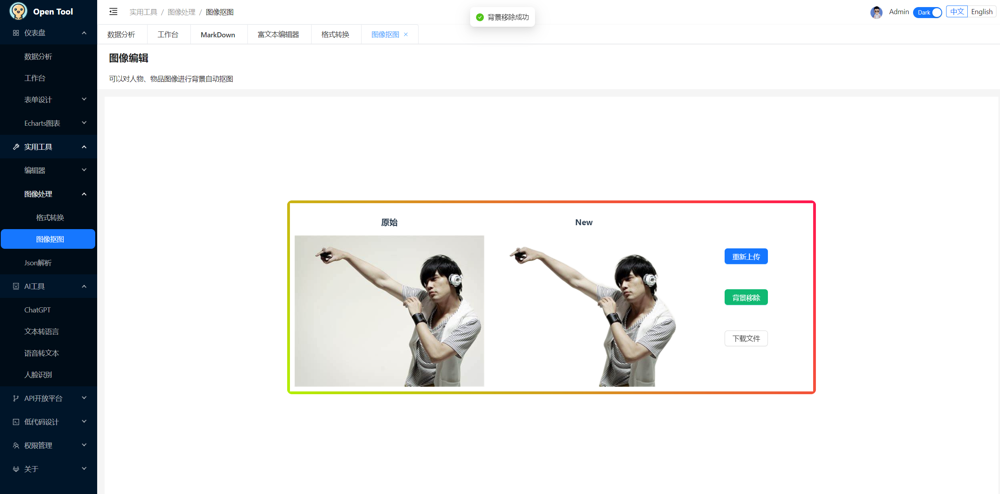

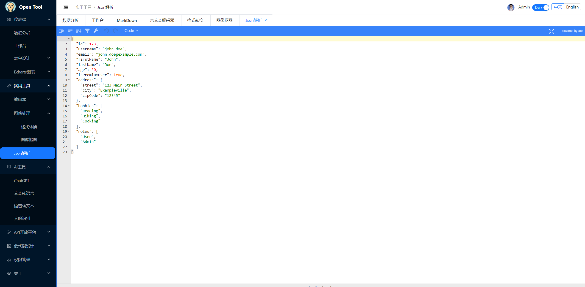

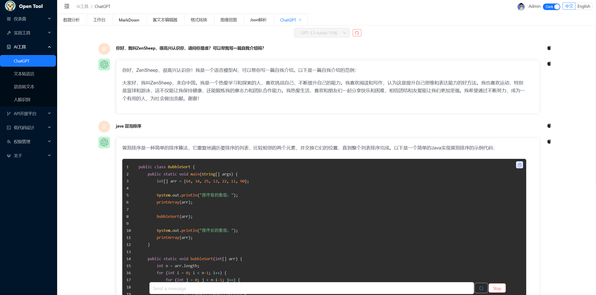

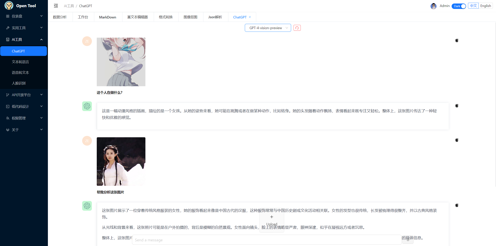


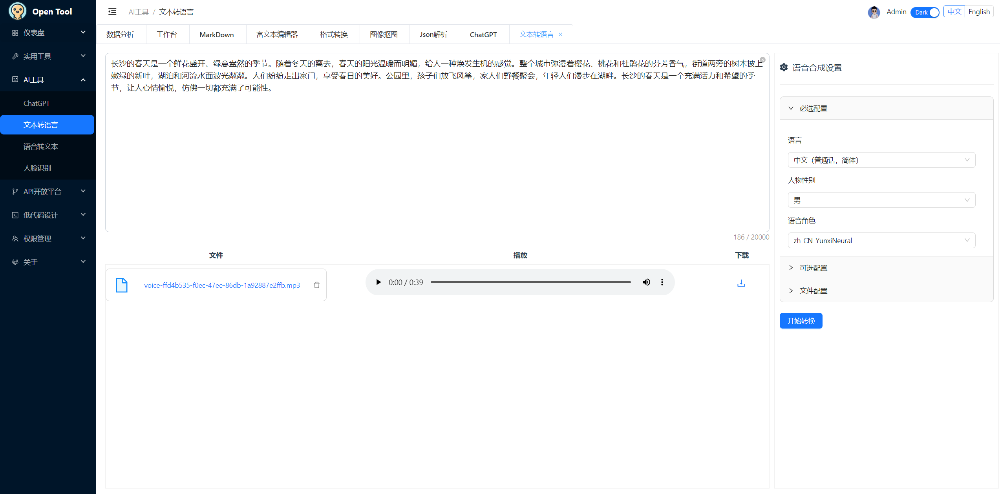

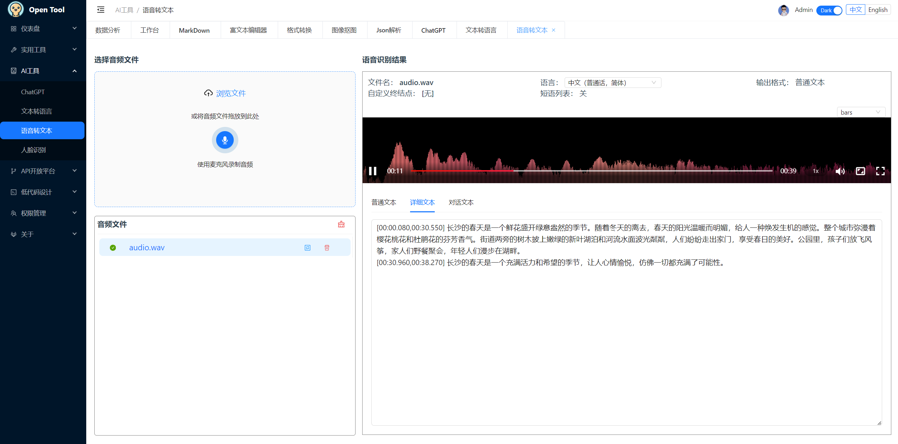
